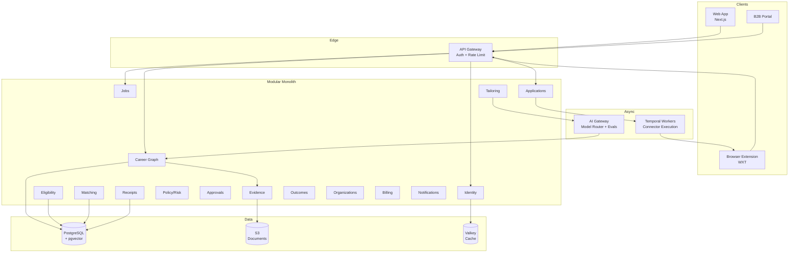

# Technical Design

## Context & Constraints

Addresses PRD FR-01 through FR-14 and all acceptance criteria. Key constraints:

- Evidence-constrained generation (FR-01) requires a Career Graph with full provenance
- Eligibility-before-ranking (FR-02) requires deterministic rule evaluation before AI
- Idempotent external actions (FR-05) require durable workflow orchestration
- Sensitive-field isolation (FR-03) requires separate storage with access controls
- Global capability transparency (FR-08) requires per-job dimension evaluation
- All stack choices are **Approved** (2026-01-15)

## Architecture

Modular monolith deployed as a single service with internal module boundaries. Temporal workers handle connector execution asynchronously. AI gateway routes requests through policy, evidence retrieval, model selection, structured generation, and multi-layer validation before human approval or execution.

## Stack

| Layer | Technology | Status | Rationale |
|-------|-----------|--------|-----------|
| Web | Next.js + TypeScript | Approved | SSR for SEO, React ecosystem, Vercel deployment |
| UI | shadcn/ui + Radix + Tailwind | Approved | Accessible primitives, customizable, no runtime overhead |
| Forms | React Hook Form + Zod | Approved | Performance, schema validation shared with API |
| Extension | WXT | Approved | Cross-browser, TypeScript-native, modern build |
| Backend | Fastify | Approved | Performance, schema validation, plugin architecture |
| Architecture | Modular monolith | Approved | Simplicity, deploy speed, clear boundaries for future extraction |
| Database | PostgreSQL + pgvector | Approved | Relational integrity, vector search, FTS in one system |
| ORM | Drizzle | Approved | Type-safe, SQL-close, migration support |
| Workflow | Temporal | Approved | Durable execution, retries, visibility for connectors (FR-05) |
| AI | Vercel AI SDK + provider abstraction | Approved | Multi-model support, streaming, structured output |
| AI Observability | Langfuse + OpenTelemetry | Approved | Trace-based eval, cost tracking, prompt management |
| Cache | Valkey | Approved | Redis-compatible, session and rate-limit storage |
| Storage | S3 | Approved | Document storage, evidence files |
| Analytics | PostHog | Approved | Product analytics, feature flags, no PII in events |
| Billing | Stripe | Approved | Subscriptions, usage-based, global |
| Infrastructure | AWS + Vercel | Approved | Managed services, edge deployment |
| IaC | OpenTofu | Approved | Terraform-compatible, open-source |
| CI/CD | GitHub Actions | Approved | Integrated with repo, matrix builds |

## Components

| Component | Responsibility | Interfaces |
|-----------|---------------|------------|
| Career Graph | Store and version candidate claims with evidence provenance | REST API, internal module calls |
| Eligibility Engine | Deterministic rule evaluation before ranking | REST API, called by Matching |
| Matching | Rank jobs by fit, eligibility, freshness | REST API, reads from Career Graph + Jobs |
| Tailoring | Evidence-constrained generation of resume/cover letter/answers | REST API, calls AI Gateway with evidence context |
| Policy Engine | Risk classification, policy precedence, approval routing | Internal module, called by Tailoring and Applications |
| Application State Machine | Manage lifecycle from DISCOVERED to SUBMITTED_VERIFIED | Temporal workflows, REST API |
| Connector Workers | Execute ATS-specific submission logic idempotently | Temporal activities, browser extension messages |
| AI Gateway | Route requests, enforce evidence constraints, validate output | Internal service, called by Tailoring + Matching |
| Receipt Generator | Produce immutable submission proofs | Called by Application State Machine on SUBMITTED_VERIFIED |

## Data & Integrations

**Entities:** User, CareerClaim, Evidence, Job, EligibilityAssessment, ApplicationPlan, Approval, Receipt, Organization, Cohort, AuditEvent. Every critical entity includes: id, tenant_id, version, source, provenance, created_at, updated_at, retention_policy, deletion_state.

**Classification:**
- PII: User identity, CV content, application answers → encrypted at rest, KMS-managed keys
- Evidence: Documents, certificates → S3 with signed URLs, access-controlled
- Audit: Immutable event log → append-only, never deleted

**Integrations:**
- ATS connectors: Versioned, synthetic-tested, kill-switchable
- Job sources: Normalized on ingestion, deduplicated, freshness-tracked
- Auth: OAuth 2.0 with scope minimization
- Email: Transactional only, no marketing without consent
- Stripe: Billing events → entitlement updates

**Failure behavior:** Connector failures → FAILED_RETRYABLE → exponential backoff → NEEDS_RECONCILIATION → manual fallback. Ambiguous results never auto-retry (FR-08).

## Security & Privacy

- TLS everywhere, encryption at rest with KMS-managed keys
- Tenant isolation via tenant_id on every query, penetration-tested
- RBAC with least privilege; privileged actions require audit logging
- Sensitive data vault for high-risk fields (FR-03)
- PII redaction before AI prompts; no secrets in prompt context
- Prompt-injection defense: untrusted content isolated in separate message roles
- Privacy: view, correct, export, delete, revoke consent, disconnect, disable learning
- Consent versioning, purpose limitation, retention schedules
- No private candidate data sold or used for recruiter advertising

## Quality Attributes

- API availability: 99.9%
- No acknowledged duplicate submissions (FR-05)
- Critical workflow recovery after worker restart (Temporal durability)
- RPO ≤ 15 minutes, RTO ≤ 4 hours
- AI eval latency p95 < 3s for tailoring requests
- Connector field accuracy ≥ 95%
- Support horizontal read scaling via PostgreSQL read replicas

## Delivery & Operations

- **Environments:** dev, staging, production (isolated tenants in staging)
- **Testing:** Unit, integration, AI eval suite, synthetic connector tests, E2E for critical journeys
- **Deployment:** Blue-green via Vercel (web) + rolling deploy (API/workers)
- **Rollout:** Feature flags for experiments; kill switches on every connector
- **Monitoring:** Structured logging, OpenTelemetry traces, Langfuse for AI, PostHog for product
- **Rollback:** Instant for web (Vercel), versioned rollback for API, Temporal workflow replay
- **Recovery:** Temporal auto-recovery, PostgreSQL point-in-time restore, S3 versioning
- **Support:** Admin console for user support, connector health, incident management

## Alternatives & Decisions

| Option | Trade-offs | Status |
|--------|-----------|--------|
| Microservices vs modular monolith | Monolith: simpler ops, faster iteration. Microservices: independent scaling. | Approved: monolith first, extract if needed |
| MongoDB vs PostgreSQL | MongoDB: flexible schema. PostgreSQL: integrity, vector, FTS in one. | Approved: PostgreSQL for integrity requirements |
| Custom workflow vs Temporal | Custom: less dependency. Temporal: durability, retries, visibility built-in. | Approved: Temporal for connector reliability (FR-05) |
| Single AI provider vs abstraction | Single: simpler. Abstraction: model flexibility, eval comparison. | Approved: abstraction for eval-driven routing |

**Implementation guidance for approved thresholds:**
- Eligibility false-positive ≤2%: Evaluate all hard requirements (location, authorization, sponsorship, licenses, mandatory qualifications). Default to Unknown when evidence is insufficient. Track false-positive rate in eval suite.
- Autopilot evidence coverage ≥80%: Before autopilot execution, compute ratio of job requirements with verified evidence to total requirements. Block autopilot if below threshold; fall back to Copilot.
- Minimum cohort size ≥5: In organization reporting queries, return "insufficient cohort size" when participant count < 5. Never expose individual data below this threshold.

## API Domains

| Domain | Responsibility | Key Endpoints |
|--------|---------------|---------------|
| `/auth` | Authentication, OAuth, sessions | POST /login, POST /logout, GET /me |
| `/users` | User profiles, preferences | GET/PUT /profile, GET/PUT /preferences |
| `/career` | Career Graph, claims, evidence | GET /claims, POST /verify, POST /evidence |
| `/jobs` | Job discovery, search, companies | GET /jobs, GET /jobs/:id, GET /companies |
| `/eligibility` | Eligibility assessment | POST /assess, GET /assessments |
| `/matches` | Job matching, ranking | GET /matches, GET /matches/:id |
| `/applications` | Application lifecycle | GET /applications, POST /apply, GET /receipts |
| `/approvals` | Approval workflow | GET /pending, POST /approve, POST /reject |
| `/organizations` | B2B orgs, cohorts, reporting | GET /orgs, GET /cohorts, GET /reports |
| `/billing` | Subscriptions, entitlements | GET /plans, POST /subscribe, GET /invoices |
| `/notifications` | In-app, email notifications | GET /notifications, PUT /preferences |
| `/admin` | Admin console operations | GET /users, GET /connectors, POST /kill-switch |
| `/privacy` | Data export, deletion, consent | POST /export, POST /delete, GET /consent |

## Domain Events

| Event | Trigger | Consumers |
|-------|---------|-----------|
| `UserActivated` | User completes onboarding | Analytics, Organizations |
| `ClaimVerified` | User verifies a CareerClaim | Career Graph, Matching |
| `EvidenceAdded` | New evidence uploaded | Career Graph |
| `JobNormalized` | Job ingested and normalized | Matching, Eligibility |
| `JobExpired` | Job staleness detected | Matching |
| `EligibilityAssessed` | Eligibility check completed | Matching, Applications |
| `MatchRanked` | Job ranked for user | Applications |
| `ApplicationPlanned` | Application plan created | Applications, Approvals |
| `ApplicationTailored` | Tailoring completed | Applications |
| `ApprovalRequested` | Approval needed | Notifications, Applications |
| `ApprovalGranted` | User approves | Applications |
| `SubmissionStarted` | Execution begins | Applications, Connectors |
| `SubmissionAcknowledged` | ATS acknowledges | Applications |
| `SubmissionVerified` | Receipt generated | Applications, Analytics |
| `SubmissionFailed` | Execution failed | Applications, Notifications |
| `ManualHandoffRequired` | Needs user action | Notifications |
| `RecruiterMessageReceived` | Inbox message | Notifications, Outcomes |
| `InterviewVerified` | Interview confirmed | Notifications, Outcomes |
| `OutcomeRecorded` | Outcome updated | Analytics, Organizations |
| `PolicyChanged` | Policy updated | Policy Engine |
| `DeletionRequested` | User requests deletion | Privacy, All modules |

## Risks

- **Temporal complexity:** Learning curve for workflow design → mitigate with team training and reference implementations
- **pgvector at scale:** Vector search performance under load → mitigate with benchmarking before production
- **Connector maintenance:** ATS UI changes break extension → mitigate with synthetic tests + versioned connectors + kill switches
- **AI cost:** Per-application generation cost → mitigate with model routing, caching, and structured output to reduce retries
- **Multi-tenant data leakage:** → mitigate with tenant_id enforcement at ORM layer + penetration testing
